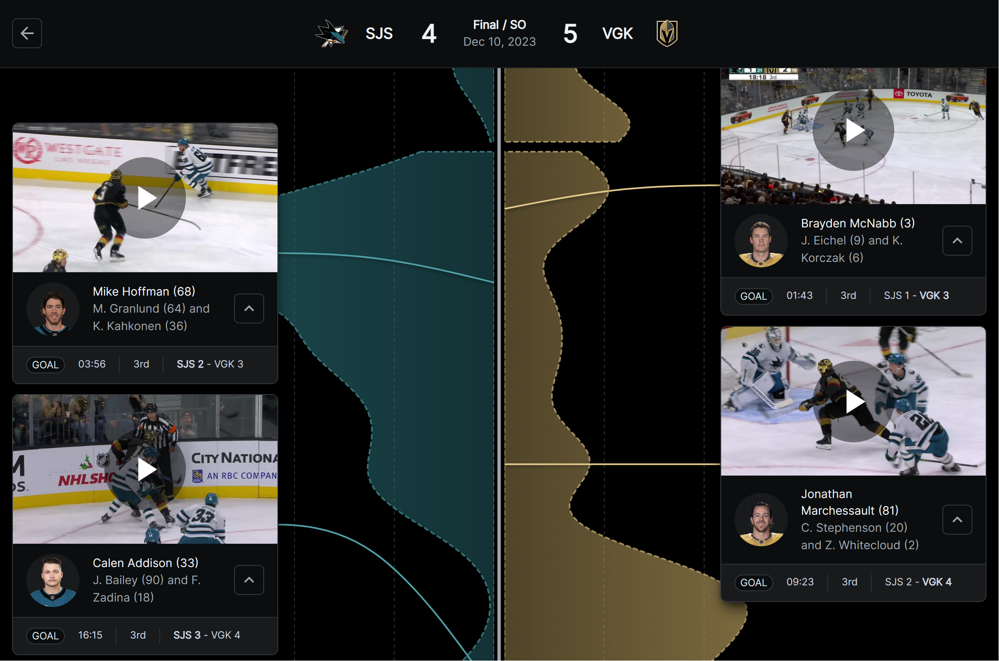

# Rinktide

**Rinktide ([`rinktide.vercel.app`](https://rinktide.vercel.app))** is a live NHL game tracker that visualizes shot pressure and offensive momentum shifts between teams.



## What's a shot tide graph?

The shot tide plot is produced using [kernel density estimation](https://en.wikipedia.org/wiki/Kernel_density_estimation). All shots (blocked, missed, saved, or goals) are replaced with a bell curve centered at the time the shot was taken, and then all the bell curves are added together to obtain a smooth, histogram-like plot of when shots were generated.

## Getting started

Rinktide is a React and Next.js app. It is deployed at [`rinktide.vercel.app`](https://rinktide.vercel.app). 

You can run the app locally in development mode:

```bash
git clone https://github.com/williamckha/rinktide
npm install
npm run dev
```

## Acknowledgements

- Micah Blake McCurdy at [HockeyViz](https://hockeyviz.com/) for developing the original shot tide chart
- NHL GameFlow (discontinued) for inspiring the design and appearance of Rinktide
- [@Zmalski](https://github.com/Zmalski/) for documenting an [unofficial reference of the NHL API](https://github.com/Zmalski/NHL-API-Reference)
